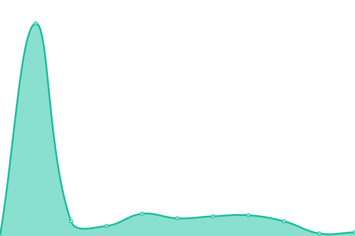
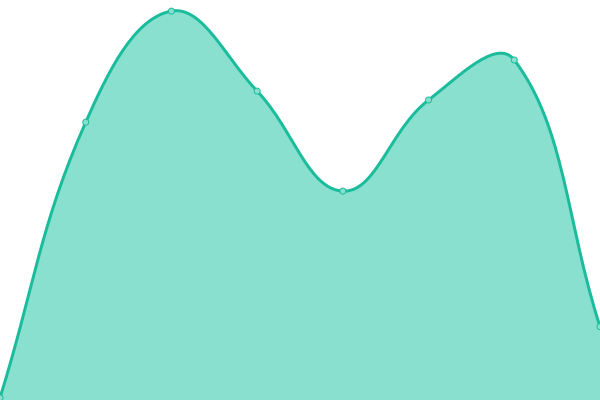

# [📈 Live Status](https://diggajupadhyay.github.io/upptime): <!--live status--> **🟩 All systems operational**

This repository contains the open-source uptime monitor and status page for [Diggaj Upadhyay](diggajupadhyay.com.np), powered by [Upptime](https://github.com/upptime/upptime).

With [Upptime](https://upptime.js.org), you can get your own unlimited and free uptime monitor and status page, powered entirely by a GitHub repository. We use [Issues](https://github.com/diggajupadhyay/upptime/issues) as incident reports, [Actions](https://github.com/diggajupadhyay/upptime/actions) as uptime monitors, and [Pages](https://diggajupadhyay.github.io/upptime) for the status page.

<!--start: status pages-->
<!-- This summary is generated by Upptime (https://github.com/upptime/upptime) -->
<!-- Do not edit this manually, your changes will be overwritten -->
<!-- prettier-ignore -->
| URL | Status | History | Response Time | Uptime |
| --- | ------ | ------- | ------------- | ------ |
|  [Diggaj Upadhyay](https://diggajupadhyay.com.np) | 🟩 Up | [diggaj-upadhyay.yml](https://github.com/diggajupadhyay/upptime/commits/HEAD/history/diggaj-upadhyay.yml) | 

 492ms
     
 | 

<a href="https://diggajupadhyay.github.io/upptime/history/diggaj-upadhyay">100.00%</a>
    

|  [Ayush Bhandari](http://ayushbhandari.com.np/) | 🟩 Up | [ayush-bhandari.yml](https://github.com/diggajupadhyay/upptime/commits/HEAD/history/ayush-bhandari.yml) | 

 479ms
     
 | 

<a href="https://diggajupadhyay.github.io/upptime/history/ayush-bhandari">99.87%</a>
    

|  [Nischal Pantha](http://bpantha.com.np/) | 🟩 Up | [nischal-pantha.yml](https://github.com/diggajupadhyay/upptime/commits/HEAD/history/nischal-pantha.yml) | 

 367ms
     
 | 

<a href="https://diggajupadhyay.github.io/upptime/history/nischal-pantha">99.87%</a>
    

|  [LKC Visuals](http://lkcvisuals.com/) | 🟩 Up | [lkc-visuals.yml](https://github.com/diggajupadhyay/upptime/commits/HEAD/history/lkc-visuals.yml) | 

 128ms
     
 | 

<a href="https://diggajupadhyay.github.io/upptime/history/lkc-visuals">100.00%</a>
    

<!--end: status pages-->

[**Visit our status website →**](https://diggajupadhyay.github.io/upptime)

## 📄 License

- Powered by: [Upptime](https://github.com/upptime/upptime)
- Code: [MIT](./LICENSE) © [Diggaj Upadhyay](diggajupadhyay.com.np)
- Data in the `./history` directory: [Open Database License](https://opendatacommons.org/licenses/odbl/1-0/)
